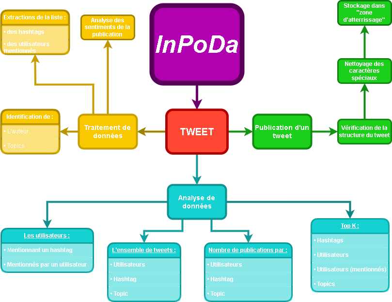

# Analyse de données de réseaux sociaux (InPoDa)

## Description

Ce projet simule une plateforme fictive appelée **InPoDa** dédiée à la collecte, au traitement et à l’analyse de données issues des réseaux sociaux.

L’objectif est de reproduire un pipeline simple de traitement de tweets afin d’en extraire des informations utiles et de générer des analyses.

Un diagramme présent dans ce dépôt illustre le processus de traitement d’un tweet dans le système InPoDa.

---

## Principe général

Les tweets passent par plusieurs étapes de traitement :

- Collecte et ingestion des données
- Nettoyage et préparation des tweets
- Extraction d’informations :
  - hashtags
  - utilisateurs mentionnés
  - auteur du tweet
- Analyse de sentiment (positif / négatif) avec `TextBlob`
- Détection simple de thèmes
- Agrégation des données pour analyse

---

## Fonctionnalités d’analyse

Le notebook permet notamment de réaliser les analyses suivantes :

- Top K hashtags
- Top K utilisateurs
- Top K utilisateurs mentionnés
- Nombre de tweets par utilisateur
- Nombre de tweets par hashtag
- Distribution des sentiments

---

## Contenu du projet

- `InPoDa.ipynb` : notebook principal contenant le code et les analyses
- `diagramme.png` : schéma du pipeline de traitement des tweets dans InPoDa

---

## Schéma du système

Le diagramme ci-dessous illustre le fonctionnement global du traitement d’un tweet :

